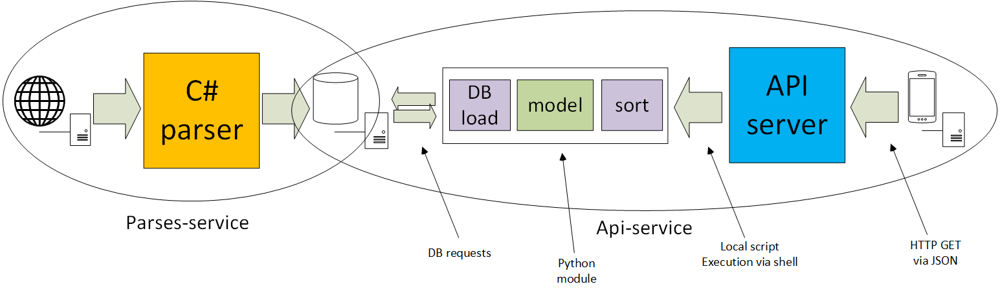

# MORE.Tech4.0
Digests and trends for specific business roles

Parse, analyze and recommend news



## Dependencies
```
pip3 install -r requirements.txt
```
# USAGE
## Deploy
API server on host:8080 (port forwarded)
```
docker compose up -d
```
ACHTUNG! Take a cup of tea for a moment, parser must work alone for a moment to accumulate data for API server service 

## Test API server via test.py
```
python3 test.py http://[HOST]:8080 "[REQUEST_TYPE]" "[ROLE or HYPOTHESIS]"
```
Where HOST - API server adress ; REQUEST_TYPE - type of task to do [digest/trends/insight] ; ROLE [ceo/accountant] or your HYPOTHESIS (cyrillic statement)

## DEV API
```
python3 test.py http://[HOST]:8080 "preprocess" "c"
```
For forced preparing parsed data 


Project Organization
------------

    ├── LICENSE
    │
    ├── README.md          <- README for developers
    │
    ├── test.py            <- script for POSTing requests
    │
    ├── docker-compose.yml <- Compose config file
    │
    ├── .gitignore         <- gitignore
    │
    ├── EDA                <- Notebooks
    │
    ├── appdata            <- Volume with data for services
    │
    ├── requirements.txt   <- The requirements file for reproducing the analysis environment, e.g.
    │                         generated with `pip freeze > requirements.txt`
    └──├─ src              <- Source code for use in this project.
       │
       ├── api-server      <- Source code for API server microservice
       │
       ├── model           <- Model scripts for API server microservice
       │
       └── parser          <- Source code for parser microservice
       
